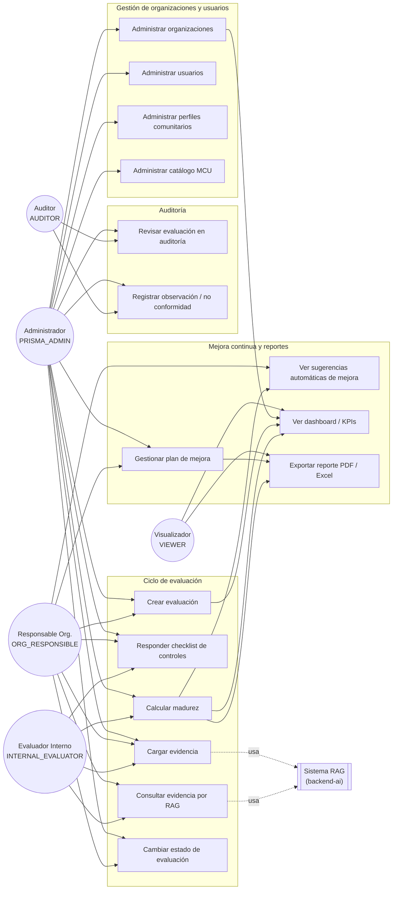

# 🎭 Diagrama de Casos de Uso — PRISMA

> Extraído directamente de los endpoints REST de `backend-core` (`@PreAuthorize` por rol) y
> `backend-ai`. Roles definidos en `UserRole` (`apps/backend-core/.../domain/entity/UserRole.java`).

## Actores

| Actor | Rol (`UserRole`) | Descripción |
|---|---|---|
| **Administrador PRISMA** | `PRISMA_ADMIN` | Rol global (no atado a una organización). Administra el catálogo, organizaciones, usuarios y perfiles comunitarios; puede todo lo que puede cualquier otro rol. |
| **Responsable de Organización** | `ORG_RESPONSIBLE` | Dueño de la evaluación dentro de su organización (tenant): la crea, carga evidencia, arma el plan de mejora. |
| **Evaluador Interno** | `INTERNAL_EVALUATOR` | Responde el checklist de controles y calcula la madurez; puede cargar y reindexar evidencia. |
| **Auditor** | `AUDITOR` | **No es un rol global** (`CurrentUserService.isGlobalRole()` sólo devuelve `true` para `PRISMA_ADMIN`) — está acotado explícitamente a las organizaciones que un `PRISMA_ADMIN` le asignó (`auditedOrganizationIds`), no ve ni audita el resto. Revisa evaluaciones en estado `IN_AUDIT`, registra observaciones/no conformidades. |
| **Visualizador** | `VIEWER` | Acceso de solo lectura a los recursos de su organización (todos los `GET` sin `@PreAuthorize` explícito solo requieren estar autenticado). |
| **Sistema RAG (backend-ai)** | — | Actor no humano: indexa evidencia en ChromaDB y responde consultas sobre el marco MCU 5.0 vía Ollama. Invocado por `backend-core` (`AiEvidenceClient`), no directamente por el usuario. |

Los roles no son excluyentes: un `User` tiene un `Set<UserRole>` (tabla `prisma.user_roles`), puede
combinar varios. El aislamiento multi-tenant (`CurrentUserService.assertOrganizationAccess`) aplica
a todos los roles salvo `PRISMA_ADMIN` (único rol verdaderamente global): `AUDITOR` está acotado a
sus organizaciones auditadas, el resto a su propio `tenant_id`.

## Diagrama general

## Detalle de casos de uso

### UC1 — Administrar organizaciones
- **Actor:** `PRISMA_ADMIN`.
- **Endpoints:** `GET/POST/PUT/DELETE /api/organizations` (`OrganizationController`).
- **Flujo principal:** alta con nombre/NIT/sector/tamaño → queda `enabled=true`.
- **Baja lógica:** `DELETE` no borra la fila (violaría las FK de `users.tenant_id` y
  `evaluations.organization_id`, que no tienen `ON DELETE CASCADE`); marca `enabled=false` y
  preserva todo el histórico (evaluaciones, evidencia, plan de mejora, auditoría) — ver
  `OrganizationService.delete()`.

### UC2 — Administrar usuarios
- **Actores:** `PRISMA_ADMIN` (sin restricción, cualquier organización o ninguna); `ORG_RESPONSIBLE`
  como "administrador" de SU PROPIA organización.
- **Endpoints:** `GET/POST/PUT/DELETE /api/users` (`UserController`).
- **Flujo principal:** alta local (`prisma.users`) + provisioning automático en Keycloak
  (`KeycloakAdminClient.createUser`) para que el usuario pueda loguearse — ver `UserService.create()`.
- **Acotamiento para `ORG_RESPONSIBLE`** (`UserService.create/update/delete`, no solo a nivel de UI):
  el `tenantId` que venga en el DTO se ignora y se fuerza siempre el propio (no puede crear/mover
  usuarios a otra organización); no puede otorgarle a nadie el rol global `PRISMA_ADMIN`; si asigna
  `AUDITOR`, las `auditedOrganizationIds` deben ser exclusivamente la propia organización. Ver
  "Endurecimientos recientes" en [`SECURITY.md`](../SECURITY.md).

### UC3 — Administrar perfiles comunitarios
- **Actor:** `PRISMA_ADMIN` (alta/baja/edición); cualquier usuario autenticado puede listarlos.
- **Endpoints:** `GET/POST/PUT/DELETE /api/community-profiles`.
- **Descripción:** subconjunto curado de controles del catálogo (p.ej. "Básico", "Estándar",
  "Avanzado") para acotar una evaluación a lo relevante de un sector, en vez del catálogo completo.

### UC4 — Administrar catálogo MCU
- **Actor:** `PRISMA_ADMIN`.
- **Endpoints:** `GET /api/catalog/versions`, `GET /api/catalog/{version}` (lectura, cualquier
  autenticado); administración vía `CatalogAdminService`/`CatalogAdminController`.
- **Descripción:** estructura jerárquica Función → Categoría → Subcategoría → Requisito → Control,
  versionada (`catalog_versions`).

### UC5 — Crear evaluación
- **Actores:** `PRISMA_ADMIN`, `ORG_RESPONSIBLE`.
- **Endpoint:** `POST /api/evaluations`.
- **Flujo:** se elige organización, versión de catálogo y, opcionalmente, un perfil comunitario que
  acota los controles a evaluar. Arranca en estado `DRAFT`.

### UC6 — Responder checklist de controles
- **Actores:** `PRISMA_ADMIN`, `INTERNAL_EVALUATOR`, `ORG_RESPONSIBLE`.
- **Endpoint:** `POST /api/evaluations/{id}/responses`.
- **Descripción:** por cada `CatalogControl` se registra cumple/no cumple (`EvaluationResponse`),
  no una autoevaluación de madurez 1-5 libre.

### UC7 — Calcular madurez
- **Actores:** `PRISMA_ADMIN`, `INTERNAL_EVALUATOR`.
- **Endpoint:** `POST /api/evaluations/{id}/calculate`.
- **Descripción:** `EvaluationService.calculateMaturity` recalcula, por subcategoría, el nivel
  acumulativo alcanzado (nivel N ⇔ todos los controles de nivel ≤ N cumplidos) y el promedio global
  de la evaluación — solo sobre las subcategorías con alguna respuesta cargada, para no diluir el
  promedio con las que todavía no se empezaron a evaluar.

### UC8 — Cargar evidencia
- **Actores:** `PRISMA_ADMIN`, `INTERNAL_EVALUATOR`, `ORG_RESPONSIBLE`.
- **Endpoint:** `POST /api/evidence` (sube a MinIO) → dispara indexado asíncrono en `backend-ai`
  (`POST /api/v1/evidence/ingest`) para poder consultarla luego por RAG.

### UC9 — Consultar evidencia por RAG
- **Actores:** `PRISMA_ADMIN`, `INTERNAL_EVALUATOR`, `ORG_RESPONSIBLE`.
- **Endpoint:** `GET /api/evidence/evaluation/{evaluationId}/control/{controlId}/citations` →
  `backend-ai` `POST /api/v1/evidence/citations`.
- **Descripción:** recupera los fragmentos de evidencia más relevantes para un control puntual,
  aislados por organización (colección Chroma `evidence-{organization_id}` separada por tenant).

### UC10 — Cambiar estado de evaluación
- **Actores:** `PRISMA_ADMIN` (cualquier transición), `ORG_RESPONSIBLE`/`INTERNAL_EVALUATOR`
  (lado autoevaluación), `AUDITOR` (lado auditoría) — ver la tabla de quién dispara cada
  transición puntual en [`API.md`](../API.md#ciclo-de-vida--transiciones-válidas).
- **Endpoint:** `PATCH /api/evaluations/{id}/status`.
- **Máquina de estados:** `DRAFT/RETURNED → IN_PROGRESS → READY_FOR_AUDIT → IN_AUDIT → APPROVED |
  RETURNED`, `APPROVED → ARCHIVED` (`Evaluation.Status` + `EvaluationService.ALLOWED_TRANSITIONS`).
  El backend valida tanto la transición (rechaza saltos/retrocesos no listados) como el rol
  específico que puede dispararla — no sólo que el rol pueda llamar al endpoint.

### UC11 — Revisar evaluación en auditoría
- **Actores:** `PRISMA_ADMIN`, `AUDITOR`.
- **Endpoint:** `GET /api/audit/observations/{evaluationId}`.

### UC12 — Registrar observación / no conformidad
- **Actores:** `PRISMA_ADMIN`, `AUDITOR`.
- **Endpoints:** `POST` / `PUT /api/audit/observations`.
- **Tipos:** `OBSERVATION`, `NON_CONFORMITY`, `RECOMMENDATION` (`AuditObservation.ObservationType`).
- **Estados:** `OPEN → IN_PROGRESS → RESOLVED → CLOSED`.

### UC13 — Gestionar plan de mejora
- **Actores:** `PRISMA_ADMIN`, `ORG_RESPONSIBLE`.
- **Endpoints:** `GET/POST/PUT /api/improvement`.
- **Descripción:** acciones correctivas por control, con responsable, prioridad, fecha límite y
  estado (`PENDING → IN_PROGRESS → COMPLETED` / `OVERDUE`).

### UC14 — Ver sugerencias automáticas de mejora
- **Actor:** cualquier usuario autenticado con acceso a la organización.
- **Endpoint:** `GET /api/improvement/{evaluationId}/suggestions`.
- **Descripción:** motor de sugerencias (RF-PLN-01) que propone acciones a partir de los controles
  con mayor `gap` (brecha entre nivel objetivo y nivel alcanzado).

### UC15 — Ver dashboard / KPIs
- **Actor:** cualquier usuario autenticado.
- **Endpoint:** `GET /api/dashboard/stats`.
- **Descripción:** evaluaciones totales, organizaciones activas (`countByEnabledTrue`), madurez
  promedio, mejoras pendientes, distribución por estado y por función.

### UC16 — Exportar reporte PDF / Excel
- **Actor:** cualquier usuario autenticado con acceso a la evaluación.
- **Endpoints:** `GET /api/reports/{id}/pdf`, `GET /api/reports/{id}/excel`.
- **Descripción:** `ReportService` genera el informe de madurez con OpenPDF / Apache POI.

## Relación con otros documentos

- Modelo de datos completo: [`modelo-entidad-relacion.md`](modelo-entidad-relacion.md).
- Clases y relaciones del dominio: [`diagrama-clases.md`](diagrama-clases.md).
- Mapeo objeto-relacional detallado: [`../mapeo-jpa.md`](../mapeo-jpa.md).
