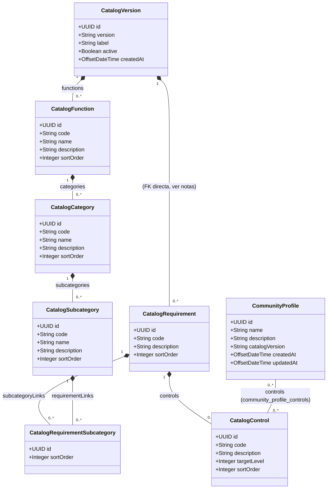
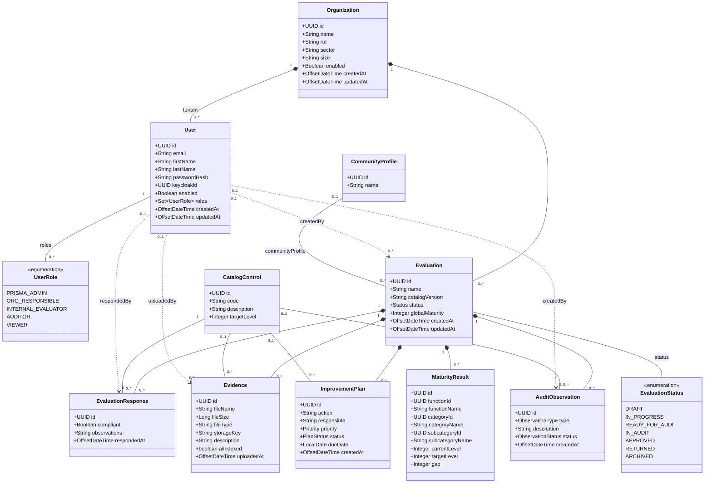

# 🧩 Diagrama de Clases (UML) — PRISMA

> Generado a partir de las entidades JPA reales en
> `apps/backend-core/src/main/java/uy/edu/prisma/domain/entity/`. Los tipos, nombres de atributos y
> relaciones (`@ManyToOne`, `@OneToMany`, `@ManyToMany`) están tomados literalmente del código, no
> son un modelo aspiracional. Para el mapeo objeto-relacional completo (columnas, `fetch`,
> `cascade`, `orphanRemoval`) ver [`../mapeo-jpa.md`](../mapeo-jpa.md).

Se divide en dos diagramas por legibilidad: el **catálogo MCU 5.0** (jerarquía fija,
independiente de una organización) y el **dominio de evaluación** (todo lo que sí depende de una
organización/tenant). Ambos comparten la clase `CatalogControl` como punto de unión.

## 1. Catálogo MCU 5.0 (jerarquía + perfiles comunitarios)

**Notas:**
- `CatalogVersion → CatalogFunction → CatalogCategory → CatalogSubcategory` y
  `CatalogVersion → CatalogRequirement → CatalogControl` son composición estricta
  (`cascade = ALL, orphanRemoval = true` en cada `@OneToMany`): borrar una `CatalogVersion` borra
  en cascada toda su jerarquía (el `ON DELETE CASCADE` real de `catalog_requirements.version_id`
  se encarga de la segunda cadena aunque el cascade de JPA no la alcance directamente). En la
  práctica no se borran versiones del catálogo, solo se desactivan (`active = false`).
- **`CatalogRequirement` ↔ `CatalogSubcategory` es N:M** vía la tabla de asociación explícita
  `CatalogRequirementSubcategory` (con `sortOrder` propio, por eso no es un `@ManyToMany` liso) —
  un mismo Requisito (con sus Controles) puede pertenecer a varias Subcategorías. `getSubcategories()`
  / `getRequirements()` son getters de conveniencia sobre esa tabla, no mapeos JPA propios.
- `CatalogControl.targetLevel` (1-4) **no** es una meta individual del control: el nivel de
  madurez de una `CatalogSubcategory` se deriva de forma acumulativa a partir de todos los
  controles de los requisitos que le llegan (directo o por más de una Subcategoría compartida) —
  ver `EvaluationService.calculateMaturity`.
- `CommunityProfile` — `CatalogControl` es `@ManyToMany` real (tabla intermedia
  `community_profile_controls`, sin columnas propias).

## 2. Dominio de evaluación (organización, usuarios, evaluaciones, auditoría)

**Notas:**
- Todas las flechas `Organization → *` son la frontera del **aislamiento multi-tenant**:
  `CurrentUserService.assertOrganizationAccess` valida en cada operación que el `tenant_id` del
  usuario coincide con el de la `Organization`/`Evaluation` sobre la que opera (salvo roles
  globales `PRISMA_ADMIN`/`AUDITOR`).
- `Organization`, al "eliminarse", solo cambia `enabled=false` (baja lógica) — nunca se borra la
  fila ni lo que cuelga de ella, justamente para no perder este historial.
- `EvaluationResponse`, `Evidence`, `ImprovementPlan` y `AuditObservation` cuelgan de `Evaluation`
  con `@ManyToOne` normal (no composición JPA), pero a nivel de negocio son parte del ciclo de
  vida de la evaluación: se consultan siempre acotados por `evaluation_id`.
- `MaturityResult` es un **snapshot desnormalizado** (nombres de función/categoría/subcategoría
  copiados al momento del cálculo, no una FK al catálogo) — se recalcula por completo
  (`deleteAllInBatch` + reinsert) cada vez que se llama a `calculateMaturity`, así que no importa
  que el catálogo cambie después.
- `AuditLog` (`audit.audit_logs`, en un schema aparte) **no** tiene relación JPA con estas
  entidades: guarda `user_id`/`tenant_id` como `UUID` sueltos (bitácora de auditoría técnica
  append-only, deliberadamente desacoplada del modelo de dominio — ver
  [`normalizacion-bd.md`](normalizacion-bd.md)).

## Referencias

- Modelo de datos / ER: [`modelo-entidad-relacion.md`](modelo-entidad-relacion.md)
- Casos de uso: [`casos-de-uso.md`](casos-de-uso.md)
- Mapeo JPA detallado: [`../mapeo-jpa.md`](../mapeo-jpa.md)
