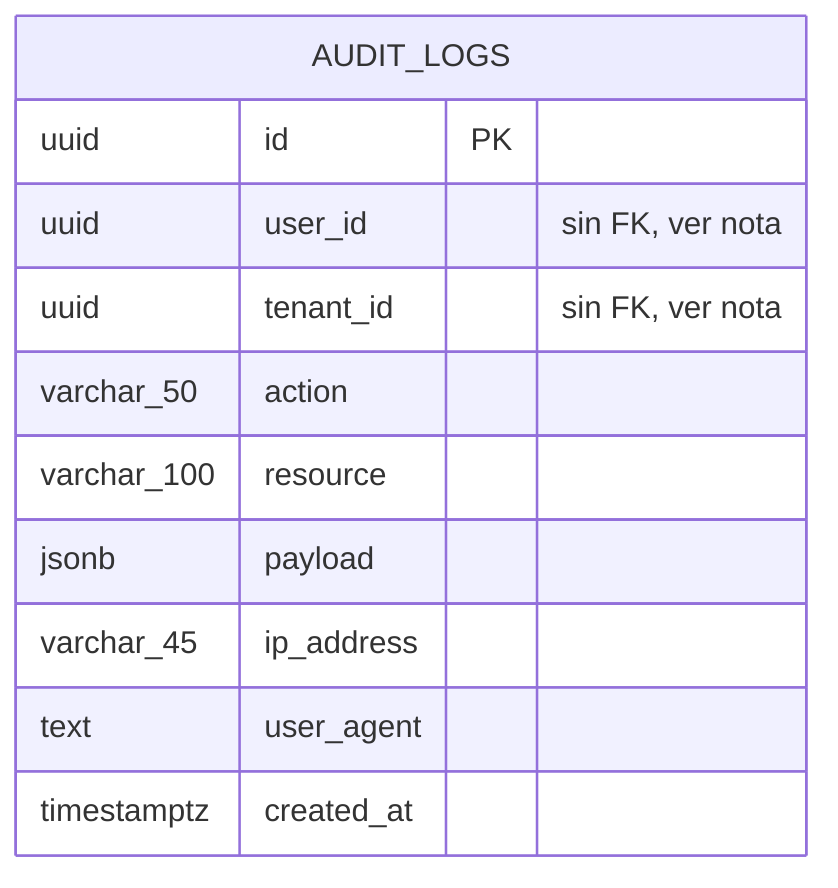

# 🗄️ Modelo Entidad-Relación — PRISMA

> Transcripto directamente de las migraciones Flyway
> (`apps/backend-core/src/main/resources/db/migration/V1` a `V17`), no del modelo JPA — refleja el
> esquema real de PostgreSQL, con todos los `ALTER TABLE` ya aplicados. Dos schemas: **`prisma`**
> (dominio de negocio) y **`audit`** (bitácora técnica, deliberadamente aislada).

## Diagrama (schema `prisma`)

```mermaid
erDiagram
  ORGANIZATIONS ||--o{ USERS : "tenant_id"
  ORGANIZATIONS ||--o{ EVALUATIONS : "organization_id"
  USERS ||--o{ USER_ROLES : "user_id (CASCADE)"
  USERS |o--o{ ORGANIZATIONS : "responsible_id"
  USERS |o--o{ EVALUATIONS : "created_by"
  USERS |o--o{ EVALUATION_RESPONSES : "responded_by"
  USERS |o--o{ EVIDENCE : "uploaded_by"
  USERS |o--o{ AUDIT_OBSERVATIONS : "created_by"

  CATALOG_VERSIONS ||--o{ CATALOG_FUNCTIONS : "version_id (CASCADE)"
  CATALOG_FUNCTIONS ||--o{ CATALOG_CATEGORIES : "function_id (CASCADE)"
  CATALOG_CATEGORIES ||--o{ CATALOG_SUBCATEGORIES : "category_id (CASCADE)"
  CATALOG_VERSIONS ||--o{ CATALOG_REQUIREMENTS : "version_id (CASCADE)"
  CATALOG_REQUIREMENTS ||--o{ CATALOG_CONTROLS : "requirement_id (CASCADE)"
  CATALOG_REQUIREMENTS ||--o{ CATALOG_REQUIREMENT_SUBCATEGORIES : "requirement_id (CASCADE)"
  CATALOG_SUBCATEGORIES ||--o{ CATALOG_REQUIREMENT_SUBCATEGORIES : "subcategory_id (CASCADE)"

  COMMUNITY_PROFILES ||--o{ COMMUNITY_PROFILE_CONTROLS : "profile_id (CASCADE)"
  CATALOG_CONTROLS ||--o{ COMMUNITY_PROFILE_CONTROLS : "control_id (CASCADE)"
  COMMUNITY_PROFILES |o--o{ EVALUATIONS : "community_profile_id (SET NULL)"

  EVALUATIONS ||--o{ EVALUATION_RESPONSES : "evaluation_id (CASCADE)"
  EVALUATIONS ||--o{ MATURITY_RESULTS : "evaluation_id (CASCADE)"
  EVALUATIONS ||--o{ EVIDENCE : "evaluation_id (CASCADE)"
  EVALUATIONS ||--o{ IMPROVEMENT_PLANS : "evaluation_id (CASCADE)"
  EVALUATIONS ||--o{ AUDIT_OBSERVATIONS : "evaluation_id (CASCADE)"

  CATALOG_CONTROLS ||--o{ EVALUATION_RESPONSES : "control_id"
  CATALOG_CONTROLS |o--o{ EVIDENCE : "control_id"
  CATALOG_CONTROLS |o--o{ IMPROVEMENT_PLANS : "control_id"
  CATALOG_CONTROLS |o--o{ AUDIT_OBSERVATIONS : "control_id"

  ORGANIZATIONS {
    uuid id PK
    varchar_200 name
    varchar_20 rut UK "nullable"
    varchar_100 sector
    varchar_50 size
    uuid responsible_id FK
    boolean enabled
    timestamptz created_at
    timestamptz updated_at
  }

  USERS {
    uuid id PK
    varchar_255 email UK
    varchar_100 first_name
    varchar_100 last_name
    varchar_255 password_hash
    uuid keycloak_id
    uuid tenant_id FK
    boolean enabled
    timestamptz created_at
    timestamptz updated_at
  }

  USER_ROLES {
    uuid user_id PK_FK
    varchar_50 role PK
  }

  CATALOG_VERSIONS {
    uuid id PK
    varchar_20 version UK
    varchar_200 label
    boolean active
    timestamptz created_at
  }

  CATALOG_FUNCTIONS {
    uuid id PK
    uuid version_id FK
    varchar_10 code
    varchar_200 name
    text description
    int sort_order
  }

  CATALOG_CATEGORIES {
    uuid id PK
    uuid function_id FK
    varchar_10 code
    varchar_200 name
    text description
    int sort_order
  }

  CATALOG_SUBCATEGORIES {
    uuid id PK
    uuid category_id FK
    varchar_20 code
    text name "TEXT desde V9 (nombres reales largos)"
    text description
    int sort_order
  }

  CATALOG_REQUIREMENTS {
    uuid id PK
    uuid version_id FK "desde V15 (antes: subcategory_id -- ver CATALOG_REQUIREMENT_SUBCATEGORIES)"
    varchar_30 code "UNIQUE(version_id, code) desde V15 (antes: UNIQUE(subcategory_id, code))"
    text description
    int sort_order
  }

  CATALOG_REQUIREMENT_SUBCATEGORIES {
    uuid id PK
    uuid requirement_id FK
    uuid subcategory_id FK
    int sort_order
  }

  CATALOG_CONTROLS {
    uuid id PK
    uuid requirement_id FK
    varchar_30 code
    text description
    int target_level "CHECK 1-5 (catalogo real usa 1-4)"
    int sort_order
  }

  COMMUNITY_PROFILES {
    uuid id PK
    varchar_150 name
    text description
    varchar_20 catalog_version
    timestamptz created_at
    timestamptz updated_at
  }

  COMMUNITY_PROFILE_CONTROLS {
    uuid profile_id PK_FK
    uuid control_id PK_FK
  }

  EVALUATIONS {
    uuid id PK
    varchar_200 name
    uuid organization_id FK
    varchar_20 catalog_version
    varchar_30 status
    int global_maturity "CHECK 1-5, nullable"
    uuid community_profile_id FK "nullable"
    uuid created_by FK
    timestamptz created_at
    timestamptz updated_at
  }

  EVALUATION_RESPONSES {
    uuid id PK
    uuid evaluation_id FK
    uuid control_id FK
    boolean compliant "reemplazo de level(int) en V11"
    text observations
    uuid responded_by FK
    timestamptz responded_at
  }

  MATURITY_RESULTS {
    uuid id PK
    uuid evaluation_id FK
    uuid function_id "snapshot, no FK"
    varchar_200 function_name "snapshot"
    uuid category_id "snapshot, no FK"
    varchar_200 category_name "snapshot"
    uuid subcategory_id "snapshot, no FK"
    text subcategory_name "TEXT desde V12, snapshot"
    int current_level "CHECK 0-5"
    int target_level "CHECK 1-5"
    int gap
  }

  EVIDENCE {
    uuid id PK
    uuid evaluation_id FK
    uuid control_id FK "nullable"
    varchar_255 file_name
    bigint file_size
    varchar_100 file_type
    varchar_500 storage_key
    uuid uploaded_by FK
    timestamptz uploaded_at
    text description
    boolean ai_indexed "V5"
  }

  IMPROVEMENT_PLANS {
    uuid id PK
    uuid evaluation_id FK
    uuid control_id FK "nullable"
    text action
    varchar_200 responsible
    varchar_10 priority
    varchar_20 status
    date due_date
    timestamptz created_at
  }

  AUDIT_OBSERVATIONS {
    uuid id PK
    uuid evaluation_id FK
    uuid control_id FK "nullable"
    varchar_30 type
    text description
    varchar_20 status
    uuid created_by FK
    timestamptz created_at
  }
```

## Diagrama (schema `audit`) — bitácora técnica, aparte a propósito



> **Por qué `audit_logs` no tiene FK a `users`/`organizations`:** es un log de auditoría técnica
> append-only (quién hizo qué, cuándo, desde dónde) que debe sobrevivir aunque el usuario o la
> organización referenciados se borren de verdad algún día — una FK con `ON DELETE CASCADE`
> borraría evidencia forense, y sin cascada un borrado real fallaría igual que le pasaba a
> `organizations`. Se opta por desacoplarlo por completo: `user_id`/`tenant_id` son UUIDs sueltos,
> resueltos a nombre en la capa de aplicación al momento de mostrarlo. Índice compuesto
> `(tenant_id, created_at)` para las consultas de auditoría por organización y rango de fechas.

## Cardinalidades — resumen

| Relación | Cardinalidad | `ON DELETE` |
|---|---|---|
| `organizations` → `users` (tenant) | 1:N | (sin acción — ver Normalización) |
| `users` → `organizations` (responsible) | 1:N | (sin acción) |
| `users` → `user_roles` | 1:N | `CASCADE` |
| `organizations` → `evaluations` | 1:N | (sin acción) |
| `catalog_versions` → `catalog_functions` → `catalog_categories` → `catalog_subcategories` | 1:N en cadena | `CASCADE` en cada nivel |
| `catalog_versions` → `catalog_requirements` → `catalog_controls` | 1:N en cadena | `CASCADE` en cada nivel |
| `catalog_requirements` ↔ `catalog_subcategories` | N:M (`catalog_requirement_subcategories`, desde V15 — un Requisito puede pertenecer a varias Subcategorías) | `CASCADE` en ambos lados |
| `community_profiles` ↔ `catalog_controls` | N:M (`community_profile_controls`) | `CASCADE` en ambos lados |
| `community_profiles` → `evaluations` | 1:N (opcional) | `SET NULL` |
| `evaluations` → `evaluation_responses` / `maturity_results` / `evidence` / `improvement_plans` / `audit_observations` | 1:N | `CASCADE` |
| `catalog_controls` → `evaluation_responses` / `evidence` / `improvement_plans` / `audit_observations` | 1:N | (sin acción) |

## Referencias

- Diagrama de clases (modelo JPA): [`diagrama-clases.md`](diagrama-clases.md)
- Normalización (1FN/2FN/3FN) y justificación de la desnormalización deliberada en
  `maturity_results`: [`normalizacion-bd.md`](normalizacion-bd.md)
- Mapeo objeto-relacional (anotaciones JPA por entidad): [`../mapeo-jpa.md`](../mapeo-jpa.md)
- Migraciones fuente: `apps/backend-core/src/main/resources/db/migration/V1` a `V17`
  (`V16` permite madurez global en 0, `V17` renombra `organizations.nit` a `rut` y lo vuelve
  opcional)
